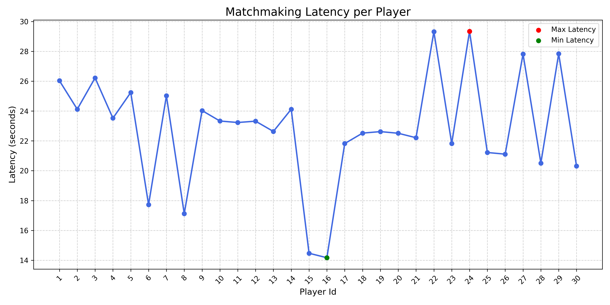

# 🎮 Game Matchmaking Engine

A scalable real-time matchmaking engine built using **Go**, **Redis**, **WebSockets**, and **Kubernetes** (via `kind` or `minikube`) to simulate game pod creation and player assignment in a distributed environment.
This system mimics real-world multiplayer games' server orchestration using custom services and Kubernetes pods.

---

## 🚀 Features

- 🧐 Matchmaking logic based on MMR, ping, game mode, and region
- ⚡ Real-time WebSocket notification to clients when match is found
- 🥉 Game Orchestrator service that creates **Kubernetes pods** dynamically
- 🌐 Generates WebSocket URL for players to connect to match pod
- ♻ Redis Queue + Pub/Sub pattern for scalable async messaging
- 🔹 Automatic cleanup of pods after timeout (e.g. 5 minutes)
- 🛠️ Built with modular architecture using `internal/` and `pkg/` folders

---

## 🏗️ System Architecture


> This project is structured into microservices communicating via HTTP, WebSockets, Redis, and Kubernetes API.

---

## 📁 Folder Structure

```
Matchmaking-Engine/
├── cmd/                  # Entrypoints for each service
│   ├── api/              # HTTP API for player service
│   ├── ws_client/        # WebSocket client simulator
│   ├── matchmaker/       # Matchmaking service runner
│   ├── orchestrator/     # Infrastrcture Controller
│   └── main.go           # Unified runner
├── internal/
│   ├── player/           # Player API handler and join logic
│   ├── matchmaking/      # Matchmaking algorithm and logic
│   ├── ws/               # WebSocket server and pub/sub
│   ├── gameorchestrator/ # Pod creation, port-forwarding, cleanup
│   └── clientSim/        # Client-side join request simulator
├── pkg/
│   └── clients/          # WebSocket connection manager
├── utils/                # Redis utils
├── examples/             # Flow, system design notes
├── README.md             # You're here
├── .env                  # Environment configs
└── go.mod / go.sum       # Go dependencies
```

---

## 🧪 Getting Started

### 1. Install Prerequisites

- Go ≥ 1.21
- Redis
- `kubectl`
- Kubernetes (via [Minikube](https://minikube.sigs.k8s.io/) or [Kind](https://kind.sigs.k8s.io/))
- Docker

### 2.Clone the Project

```bash
git clone https://github.com/Yashh56/matchmakingEngine.git
```

### 3. Setup Kubernetes Cluster

```bash
minikube start
# OR
kind create cluster --name matchmaking-cluster
```

### 4. Run Redis

```bash
docker run --name matchmaking-redis -p 6379:6379 -d redis
```

### 5. Start Services

In separate terminals or tmux panes:

```bash
# Start Player API
go run ./cmd/api/main.go

# Start Matchmaker
go run ./cmd/matchmaker/run.go

# Orchestrator service
go run ./cmd/orchestrator/main.go

```

#### OR

```bash
# Run all the servers via .bat file
.\run_server.bat
```

---

### 🤖 Test

```bash
# POST Request to API Server
go run ./cmd -player_id=12 -mmr=1620 -region=asia -ping=30 -mode=solo

# Start Notification WS server
go run ./cmd/ws_client/main.go --player_id= id

```

## ⚙️ Matchmaking Flow

1. Players join via `/join_queue` (HTTP POST).
2. Player is added to Redis queue.
3. Matchmaker scans queue and forms matches.
4. Match is published via Redis Pub/Sub.
5. Game Orchestrator listens and creates a pod.
6. Pod is exposed via dynamic port-forwarding.
7. Players receive WebSocket URL for that pod.
8. After 5 minutes, pod is cleaned up.

---

## 📡 WebSocket Structure

**Match Notification**

```bash
📨 [14:30:25] New Message Received
────────────────────────────────────────────────────────────
🎯 MATCH FOUND!

📋 Match ID: bf93e3f1-5517-4d8f-a162-44400a40fb30
🌐 Server: ws://localhost:22901/ws
🗺️  Region: ASIA
👥 Players:
   Player 1:
     🆔 ID: 1
     ⭐ MMR: 1000
     📶 Ping: 30ms
     🎮 Mode: solo
     🌍 Region: asia
     ⏰ Joined: 14:30:20

   Player 2:
     🆔 ID: 3
     ⭐ MMR: 1000
     📶 Ping: 30ms
     🎮 Mode: solo
     🌍 Region: asia
     ⏰ Joined: 14:30:24

💬 Message: 🎯 You've been matched!
────────────────────────────────────────────────────────────
```

---

## 🧼 Pod Lifecycle

- Pods are auto-deleted 5 minutes after creation using `time.AfterFunc()`.
- Port forwarding is handled using `kubectl port-forward` invoked from Go code.
- Ports are assigned dynamically (range: 20000-30000).

---

## 🛡️ Security Notes

- This project is for educational/demo purposes.
- Do **not** expose this architecture publicly without auth, rate-limiting, or pod isolation.

---

## 🧠 Learnings

- Go with `client-go` for K8s API automation
- Redis Pub/Sub and queue semantics
- Real-time server orchestration simulation
- Modular microservice communication patterns

---

## 📸 Screenshots



## This chart visualizes how long each player waited before a match was successfully formed

## 🧪 License

This project is licensed under the [MIT License](./LICENSE) © 2025 Yash Saini.
